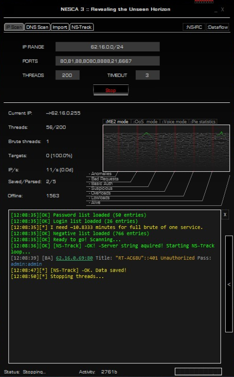

Nesca
----
Сканер сети. Легендарный. Твой.



### История возникновения

Был разработан нетсталкерской группой ISKOPASI как универсальный сканер для всего сущего^W Интернета, брута, отсева и собирания базы находочек. База находок ныне мертва, группа тоже.

### Бинарники

[Билд win32 старой версии 24D87-801](https://mega.nz/#!yZV3UDpY!6D5k-Dd1amF0i_rzIhFM-WU7cdN3pxR2mwsYiIqedtU), пароль - 24D87-801

### Самостоятельная сборка

Для компиляции необходимы `libssh`, `openssl` и `Qt`. Под Windows компилировать через MinGW.

Установка необходимого под Ubuntu:

1. [Официальный дистрибутив Qt5](https://wiki.qt.io/Install_Qt_5_on_Ubuntu)

2. Пакеты зависимостей:

```
sudo apt-get install qtmultimedia5-dev libqt5multimediawidgets5 libqt5multimedia5-plugins libqt5multimedia5 libssh-dev
```

Сборка:

```
git clone https://github.com/pantyusha/nesca.git
qmake
make
```

### Сборка с помощью Docker

Можно сбилдить с помощью контейнера на основе Ubuntu 14.04, достаточно одной команды в директории с репозиторием:
```
docker build .
```

Для запуска Nesca прямо из контейнера выполнить:
```
docker run -i -e DISPLAY=$DISPLAY -v /tmp/.X11-unix/:/tmp/.X11-unix <IMAGE ID>
```